## 프로젝트 기본 구성


---

## H2 콘솔 사용하기

```java
//application.properties 파일에 설정 추가  

spring.h2.console.enabled=true
```

- 어플리케이션을 실행하면

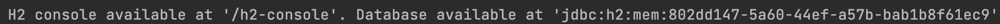

→ H2 콘솔 관련 로그 확인 가능

- [localhost:8080/h2-console/](http://localhost:8080/h2-console/) 접속 시 h2 데이터베이스가 자체적으로 제공하는 웹 어플리케이션 콘솔이 나옴


로그에서 나온 H2 데이터베이스 주소로 위의 콘솔 로그인 창의 JDBC URL에 붙여넣고 접속하면,

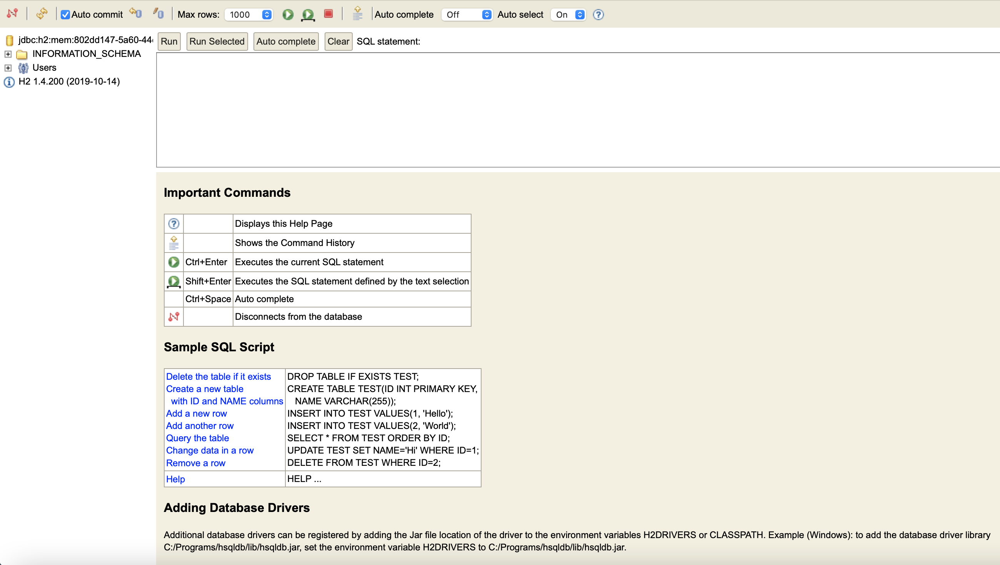

- H2 메모리 주소 고정하기 

H2는 메모리 데이터베이스이기 때문에 실행할 때마다 매번 데이터베이스가 초기화되고, 주소가 바뀜 

```java
//application.properties 파일에 설정 추가 
spring.datasource.url=jdbc:h2:mem:demo
```

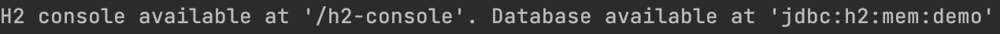

→ H2 데이터베이스 주소가 고정됨 

---

## JPA 사용하기

#### 1. Entity 생성

Entity는 데이터베이스에서 테이블에 해당함

```java
// 초기 패키지 명/entity/Customer.java 생성
package com.example.demo.entity;

import lombok.Data;

import javax.persistence.Column;
import javax.persistence.Entity;
import javax.persistence.GeneratedValue;
import javax.persistence.Id;

@Data
@Entity
public class Customer {
    @Id
    @GeneratedValue(strategy = GenerationType.IDENTITY)
    private int id;
    private String name;
    @Column(length=1024)
    private String address;
}
```

→ Entity Annotation을 통해 스프링부트가 해당 클래스를 Entity라고 인식하고, 데이터베이스에 해당 Entity가 없을 때에는 새로 테이블을 생성해줌

→ @Id 를 통해 테이블의 PK를 설정해줘야 함

→ @GeneratedValue를 통해 id값 자동 생성 가능함

→ startegy=GenerationType.IDENTITY를 사용해 밑에 나오는 db.sql에서 객체 생성 시 id 자동으로 추가 가능함

→ 필드의 크기를 변경하고자 하면, @Column를 통해 길이 변경 가능함

→ @Data를 사용해 private으로 선언된 멤버 변수 접근 가능하도록 함 → Getter&Setter 자동 생성해줌


→ H2 콘솔에 재접속하면, 해당 테이블이 생성되었음을 알 수 있음    

#### 2. Repository 생성

Repository는 데이터베이스의 테이블에 저장되는 객체에 대한 CRUD를 위한 API를 의미함 

```java
package com.example.demo.dao;

import com.example.demo.entity.Customer;
import org.springframework.data.repository.CrudRepository;

public interface CustomerRepository extends CrudRepository<Customer, Integer>{}
```

→ CrudRepository 인터페이스를 상속받으므로, 해당 인터페이스에서 제공하는 메서드들을 모두 사용 가능함(지정한 Domain Type에 대한 CRUD 메서드 수행 가능)

→ CrudRepository<T, ID>에서 T : Entity, ID : PK의 타입   

#### 3. Controller 생성

Controller를 통해 Repository 사용해 객체 CRUD 수행 가능함 

~~~java
```java
package com.example.demo;

import com.example.demo.dao.CustomerRepository;
import com.example.demo.entity.Customer;
import org.springframework.web.bind.annotation.*;

import java.util.List;

@RestController
public class CustomerController {

    private CustomerRepository repository;

    public CustomerController(CustomerRepository repository){
        super();
        this.repository = repository;
    }

    @PostMapping("/customer")
    public Customer postCustomer(Customer customer){
        return repository.save(customer);
    }

    @PutMapping("/customer")
    public Customer putCustomer(Customer customer){
        return repository.save(customer);
    }

    @DeleteMapping("/customer")
    public void deleteCustomer(int id){
        repository.deleteById(id);
    }

    @GetMapping("/customer")
    public Customer getCustomer(int id){
        return repository.findById(id).orElse(null);
        //return repository.findById(id).orElseThrow();
    }

    @GetMapping("/customer/list")
    public List<Customer> getCustomerList(){
        return (List<Customer>)repository.findAll();
    }
}
```
~~~

#### 4. CRUD 테스트

##### 1) POST

```java
@PostMapping("/customer")
public Customer postCustomer(Customer customer){
	return repository.save(customer);
}
```

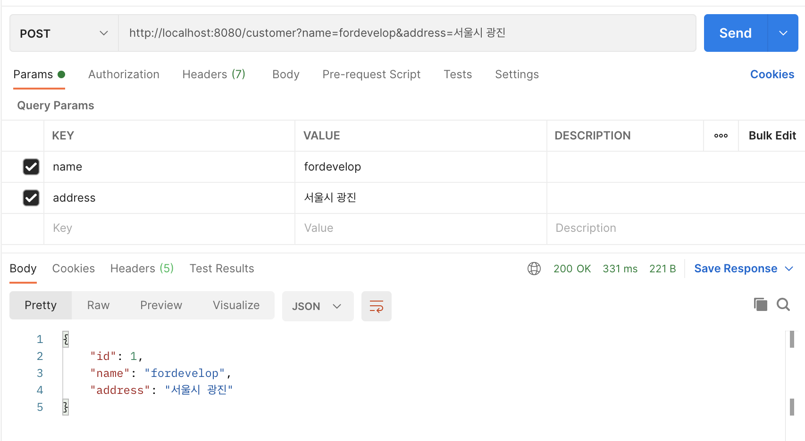

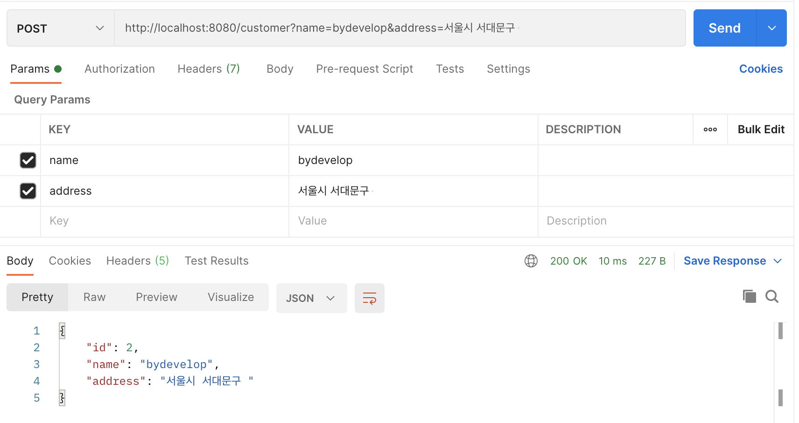

→ Customer Entity에서 PK인 id는 자동으로 생성되도록 설정했으므로, 따로 인자로 전달하지 않아도 자동 생성됨

→ 작동 흐름 : 전달된 param으로 Customer 객체에 값들이 세팅됨 → 해당 Controller API가 호출되고 생성된 Customer 객체가 전달됨 → Repository의 save()가 호출되면서 데이터베이스에 저장함

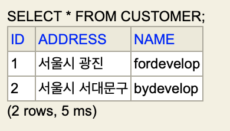

→ H2 콘솔로 접속해보면, 해당 객체가 생성되었음을 알 수 있음 

##### 2) UPDATE

```java
@PutMapping("/customer")
public Customer putCustomer(Customer customer){
	return repository.save(customer);
}
```

기존 : 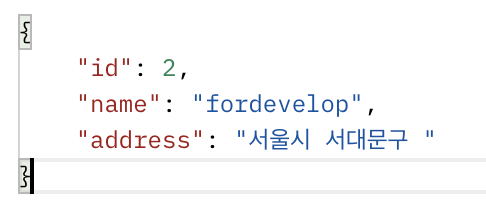

수정 후 : 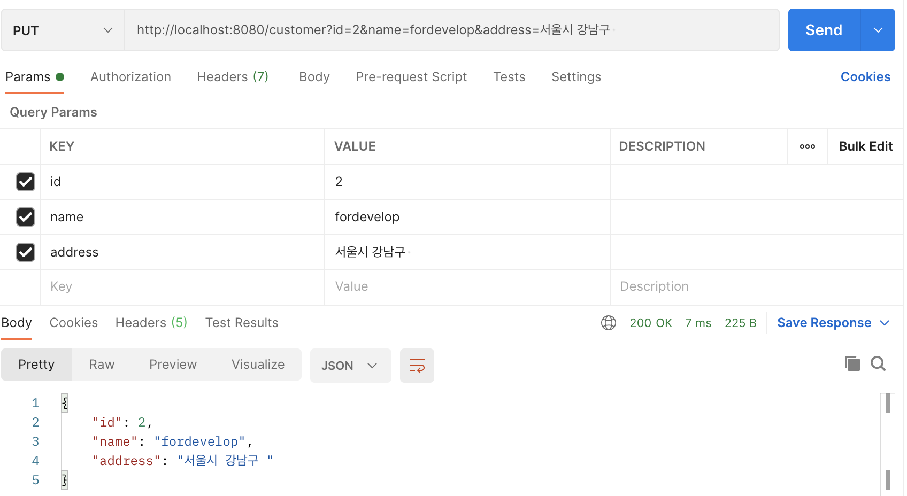


##### 3) DELETE

```java
@DeleteMapping("/customer")
public void deleteCustomer(int id){
	repository.deleteById(id);
}
```

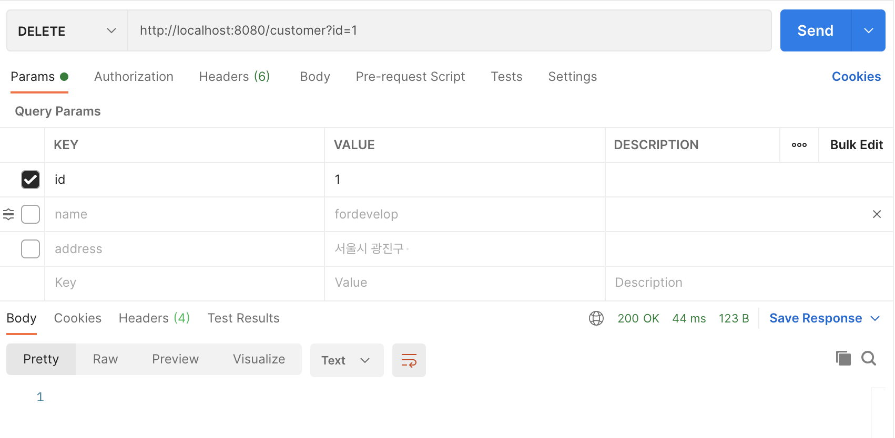

→ param으로 전달된 id 값과 동일한 객체가 정상적으로 삭제되었음을 알 수 있음 

##### 4) GET

##### 4-1) 특정 객체 조회

```java
@GetMapping("/customer")
public Customer getCustomer(int id){
	return repository.findById(id).orElse(null);
}
```

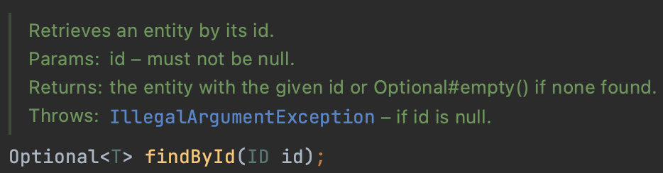

→ CrudRepository 인터페이스에 선언된 findById()를 보면 반환값이 Optional<T> 임을 알 수 있음. 따라서 전달된 id에 해당하는 객체가 없을 때를 처리해줘야 하므로 orElse(null)를 사용함

→ id에 해당하는 객체가 없을 때 예외 발생시키려면, orElseThrow()를 사용하면 됨

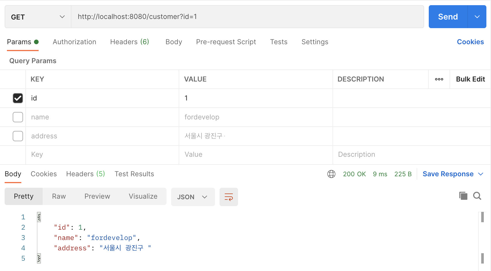

→ param으로 전달된 id값에 해당하는 객체를 찾아 정상적으로 반환해줌 

##### 4-2) 전체 객체 조회

```java
@GetMapping("/customer/list")
public List<Customer> getCustomerList(){
	return (List<Customer>)repository.findAll();
}
```

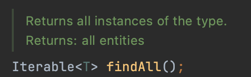

→ CrudRepository 인터페이스에 선언된 findAll()을 보면 반환형이 Iterable<T> 임. 하지만 위의 코드에서 반환값을 List<T>로 설정하였으므로 Iterable → List 으로 down-casting 해줘야 함. 이때 **down-casting의 조건**은 List 인터페이스가 Iterable 인터페이스를 상속받고, List → Iterable로 up-casting된 객체의 경우에만 가능한데,

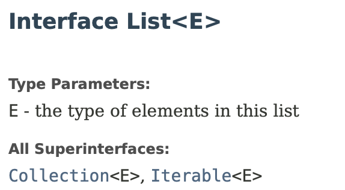

→ List 인터페이스는 Iterable 인터페이스를 상속받고, 

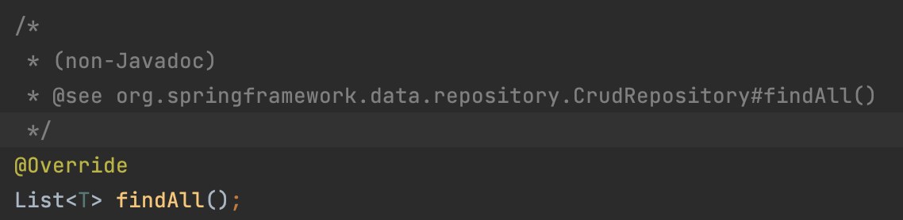

→ findAll() 메소드가 구현되어있는 JpaRepository 인터페이스를 보면, 반환형이 List<T>이므로 up-casting 되었음을 알 수 있음. 따라서 down-casting이 가능함

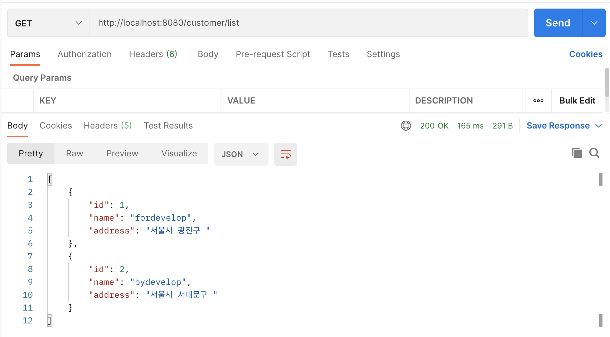

→ db에 있는 모든 객체를 정상적으로 배열 형태로 반환함을 알 수 있음 

---

## 추가

#### 추가1 - 객체 미리 생성해두기

```sql
// ~/src/main/resources/data.sql
insert into customer(name, address) values('fordevelop', '서울시 광진구')
insert into customer(name, address) values('sewon', '서울시 서대문구')
insert into customer(name, address) values('Pooh', '서울시 광진구')
insert into customer(name, address) values('Snoopy', '서울시 동작구')
```

→ H2 데이터베이스는 in-memory 데이터베이스이므로,  DB 사용 시 어플리케이션을 실행 할 때마다 db가 초기화되므로 매번 객체를 생성해줘야하는데 data.sql 파일에 객체 생성 sql문을 작성해둠으로서 해결 가능

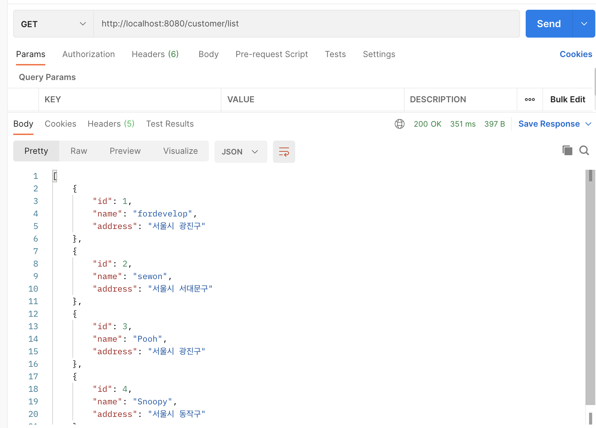

→ 전체 객체 조회를 통해 정상적으로 생성되었음을 알 수 있음 

#### 추가2 - Repository에 메서드 추가하기

##### 예시1) name 필드 값으로 객체 찾기

```java
// CustomerController.java
@GetMapping("/customer/name")
public List<Customer> getCustomer(String name){
	return repository.findByName(name);
}

// CutomerRepository.java
public interface CustomerRepository extends CrudRepository<Customer, Integer> {
    List<Customer> findByName(String name); 
}
```

→ springboot가 자동으로 메서드 이름 분석해서 name으로 객체 찾는 메서드 수행 가능하게 해줌

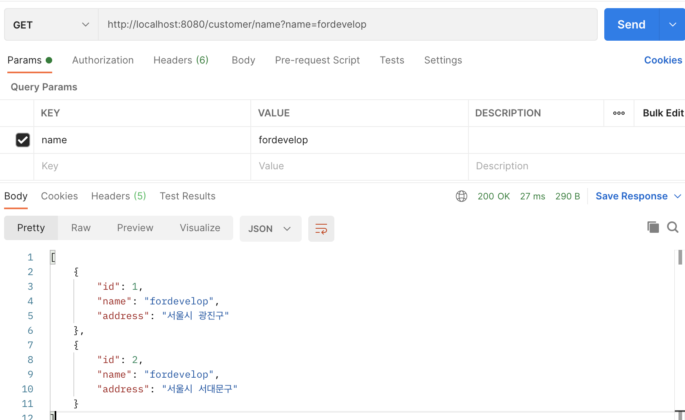

##### 예시2) name의 일부를 가지고 객체 조회하기

```java
// CustomerController.java
@GetMapping("/customer/search")
public List<Customer> searchCustomer(String name){
	return repository.findByNameLike("%" + name + "%");
}

// CutomerRepository.java
public interface CustomerRepository extends CrudRepository<Customer, Integer> {
	List<Customer> findByNameLike(String name); 
}
```

→ findByNameLike() 메서드 이름을 분석해 Like 검색 수행함 

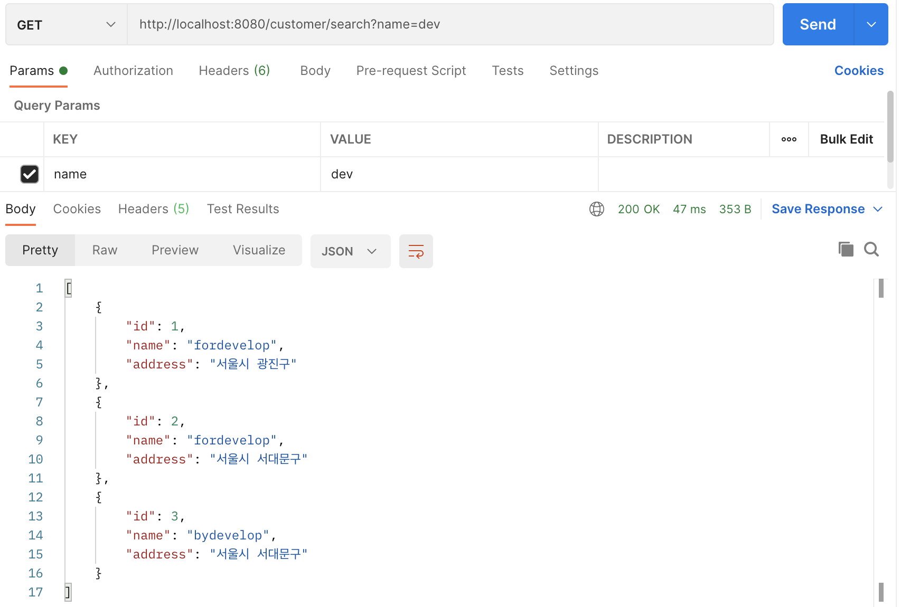

→ 객체 중에서 name 필드의 값에 'dev'가 들어가는 객체들이 반환됨 

##### 예시3) 복합 검색 수행하기(직접 쿼리 작성하기) - 2가지 방식!

1. Native Query 사용

```java
@Query(value="select * from Customer where name = ?1 and primary_contact = ?2", nativeQuery = true)
List<Customer> findVipList2(String name, int primaryContact);
```

2. JPQL 사용

```java
//JPQL 사용, ?1 : 첫 번째 param, ?2 : 두 번째 param
@Query("from Customer where name = ?1 and primaryContact = ?2")
List<Customer> findVipList(String name, int primaryContact);
```

→ 위의 코드만을 통해 알 수 있는 둘의 간단한 차이점은 Native Query의 경우 SQL문을 그대로 사용하므로, DB에 저장되는 필드 이름 그대로를 사용해야 함. 따라서 primary_contact으로 표시했고, JPQL의 경우에는 Entity 내에서 선언한 필드 이름을 사용해도 되므로 primaryContact으로 표시함

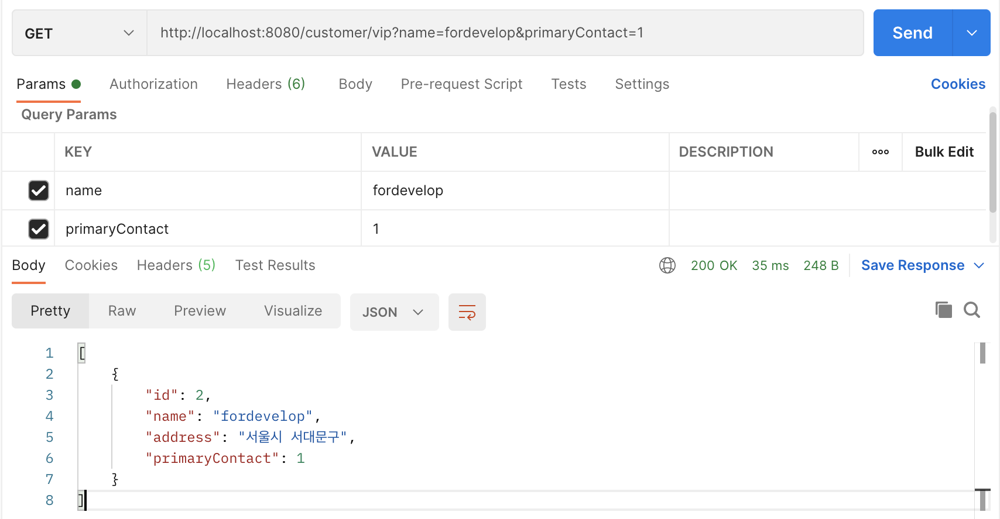

→ name과 primaryContact의 값을 param으로 전달 시 둘의 값을 모두 만족하는 객체만 반환됨을 알 수 있음    

---

###      

##### 참고자료

https://www.youtube.com/watch?v=WZDth-5KP5M

