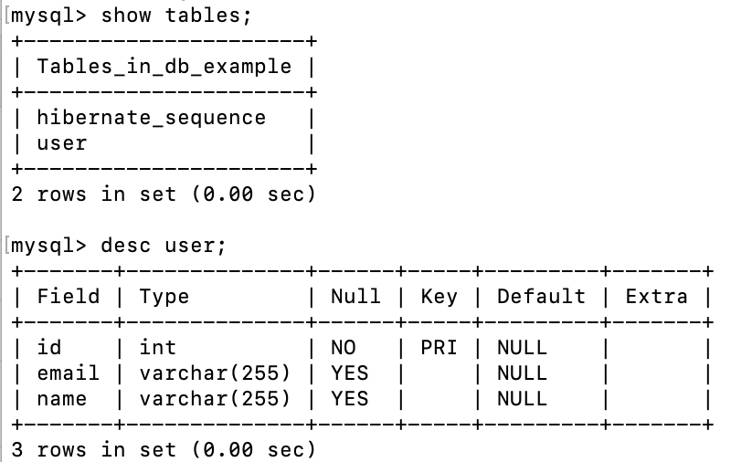

## Accessing Data with MySQL

### 프로젝트 버전 및 구성


Spring Web, Spring Data JPA, MySQL Driver 의존성 추가   

---

### DB 생성


→ 데이터베이스 생성

→ springuser라는 사용자 생성

→ springuser 사용자에게 db_example 데이터베이스 관련 모든 권한 부여

---

### application.properties 파일에 DB 관련 내용 추가

→ 스프링부트의 default 데이터베이스는 H2 데이터베이스로 해당 db 관련 default 설정을 해줌. 따라서 다른 db를 사용하고자 한다면, [application.properties](http://application.properties/) 파일에 따로 설정해줘야 함


→ spring.jpa.hibernate.ddl-auto의 경우 4가지 설정이 가능함

1. none : default for MySQL. DB structure에 아무 변화를 주지 않음
2. update : 주어진 entity structure를 바탕으로 Hibernate이 db를 변경함
3. create : 매번 db 생성함. 닫을 때도 삭제하지 않음
4. create-drop : db 생성함. SessionFactory가 닫히면 삭제됨.

→ db structure가 없을 때는 create이나 update로 시작함. db structure 구성 후, update나 none으로 상황에 맞게 변경 가능함.

​	→ H2나 다른 내장 db의 경우 create-drop으로 설정되어있기 때문에 어플리케이션 실행 시마다 db가 초기화되는 것임!

​	→ MySQL은 none이 초기 설정임

추가 정보) db 배포 후에는 none으로 설정하고, 연결한 MySQL user에게 SELECT, UPDATE, INSERT, DELETE 권한만 부여하도록 수정하는 것이 좋음 

---

### Entity 생성

```Java
package com.example.demo;

import javax.persistence.Entity;
import javax.persistence.GeneratedValue;
import javax.persistence.GenerationType;
import javax.persistence.Id;

@Entity // tells Hibernate to make a table out of this class
public class User {
    //엔티티타입 설정
    @Id
    @GeneratedValue(strategy = GenerationType.AUTO)
    private Integer id; //PK

    private String name;

    private String email;

    public Integer getId() {
        return id;
    }

    public void setId(Integer id) {
        this.id = id;
    }

    public String getName() {
        return name;
    }

    public void setName(String name) {
        this.name = name;
    }

    public String getEmail() {
        return email;
    }

    public void setEmail(String email) {
        this.email = email;
    }
```

→ Hibernate가 자동적으로 entity를 db table로 생성해줌

---

### Repository 생성

```java
package com.example.demo;

import org.springframework.data.repository.CrudRepository;

//This will be AUTO IMPLEMENTED by Spring into a Bean called userRepository

public interface UserRepository extends CrudRepository<User, Integer> {

}
```

→ 스프링이 자동적으로 해당 repository 인터페이스를 userRepository라는 이름으로 bean에다가 구현함

---

### Controller 생성

 → HTTP 요청을 처리하기 위한 controller를 생성해줌 

```java
package com.example.demo;

import org.springframework.beans.factory.annotation.Autowired;
import org.springframework.stereotype.Controller;
import org.springframework.web.bind.annotation.*;

@Controller //means this class is a Controller
@RequestMapping(path="/demo") //this means URL start with /demo
public class MainController {
    @Autowired //this means to get the bean called userRepository -> 생성자 대신하는 역할인듯
    private UserRepository userRepository;

    @PostMapping(path="/add")
    public @ResponseBody User addNewUser(@RequestParam String name, @RequestParam String email){ 
        User newUser = new User();
        newUser.setName(name);
        newUser.setEmail(email);
        userRepository.save(newUser);
        return newUser;
    }

    @GetMapping(path="/all")
    public @ResponseBody Iterable<User> getAllusers(){
        return userRepository.findAll();
    }
}
```

→ @Controller : 해당 class가 Controller임을 의미함

→ @RequestMapping(path="/demo") : URL이 /demo로 시작함을 의미함

→ @Autowired : this means to get the bean called userRepository 

```java
//원래는
private UserRepository userRepository;

public MainController(UserRepository userRepository){
	super(); 
	this.userRepository = userRepository; 
}
//이렇게 생성자를 만들어줘야 했는데 @Autowired로 코드 생략 가능한 듯
```

→ @ResponseBody : 반환되는 값이 respone임을 의미함

→ @RequestParam : GET 이나 POST 요청으로부터 전달된 parameter

---

### Application Class

```java
//DemoApplication.java 
package com.example.demo;

import org.springframework.boot.SpringApplication;
import org.springframework.boot.autoconfigure.SpringBootApplication;

@SpringBootApplication
public class DemoApplication {

   public static void main(String[] args) {
      SpringApplication.run(DemoApplication.class, args);
   }

}
```

→ 스프링부트가 자동으로 생성해줌 

→ @SpringBootApplication은 여러 내용을 포함하고 있음 

---

### TEST 수행

*MySQL 접속하여 Table 생성 확인



→ 어플리케이션을 실행하면 연결한 db에 user table이 생성되었음을 알 수 있음


*HTTP 요청 테스트

1) POST

URL : /demo/add

Param : name, email


2) GET

URL : /demo/all


---

참고) https://spring.io/guides/gs/accessing-data-mysql/

