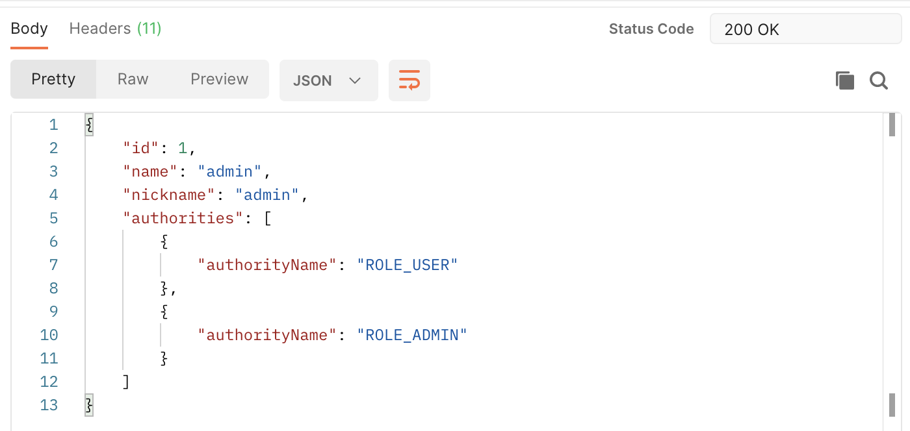
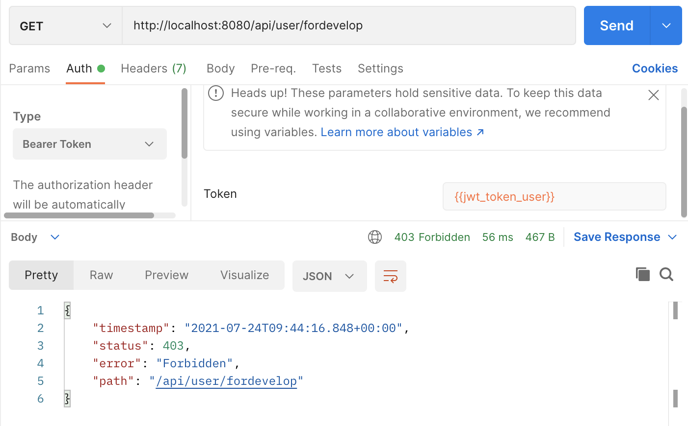

# SpringBoot & SpringSecurity & JWT 서버 구현

## 목차

[프로젝트 구성](#프로젝트-구성)

[프로젝트 소스코드 구성](#프로젝트-소스코드-구성)

[401 Unauthorized 문제 상황 확인](#401-Unauthorized-문제-상황-확인)

- [API TEST1](#API-TEST1)

- [401 Unauthorized 문제 상황 해결을 위한 Security 설정](#401-Unauthorized-문제-상황-해결을-위한-Security-설정)
  - [API TEST2](#API-TEST2)

[JWT 적용을 위한 기본적인 구성](#JWT-적용을-위한-기본적인-구성)

1. [Entity 생성](#Entity-생성)
2. [H2 데이터베이스에 데이터 자동 생성](#H2-데이터베이스에-데이터-자동-생성)
3. [H2 콘솔 접근을 위한 Security 설정 수정](#H2-콘솔-접근을-위한-Security-설정-수정)

[JWT 관련 코드 작성](#JWT-관련-코드-작성)

1. [application.yml 설정 추가](#application.yml-설정-추가)
2. [build.gradle에 JWT dependencies 추가](#build.gradle에-JWT-dependencies-추가)
3. [Token Provider 생성 - 토큰 생성, Authentication 객체 반환, 토큰의 유효성 검증](#Token-Provider-생성---토큰-생성,-Authentication-객체-반환,-토큰의-유효성-검증)
4. [JWT를 위한 커스텀 필터인 JwtFilter 클래스 생성](#JWT를-위한-커스텀-필터인-JwtFilter-클래스-생성)
5. [JwtSecurityConfig 클래스 추가 - TokenProvider와 JwtFilter를 SecurityConfig에 적용할 때 사용](#JwtSecurityConfig-클래스-추가---TokenProvider와-JwtFilter를-SecurityConfig에-적용할-때-사용)
6. [유효한 자격증명을 제공하지 않고 접근하려 할 때 401 Unauthorized 에러를 리턴할 JwtAuthenticationEntryPoint 클래스 생성](#유효한-자격증명을-제공하지-않고-접근하려-할-때-401-Unauthorized-에러를-리턴할-JwtAuthenticationEntryPoint-클래스-생성)
7. [권한이 존재하지 않는 경우 403 forbidden 에러를 리턴할 JwtAccessDeniedHandler 클래스 생성](#권한이-존재하지-않는-경우-403-forbidden-에러를-리턴할-JwtAccessDeniedHandler-클래스-생성)
8. [SecurityConfig 파일 설정 추가](#SecurityConfig-파일-설정-추가)

[DTO](#DTO)

1. [LoginDTO → 로그인 요청 시 사용할 DTO](#LoginDTO-→-로그인-요청-시-사용할-DTO)
2. [TokenDTO](#TokenDTO-(토큰-정보를-response-할))
3. [UserDto → 회원가입 요청 시 사용할 DTO](#UserDto-→-회원가입-요청-시-사용할-DTO)

[추가 개념 정리](#추가-개념-정리)

[Repository](#Repository)

[Service](#Service)

[Controller](#Controller)

- [로그인 API](#로그인-API)
- [API TEST](#[API-TEST3])

[회원가입 API 생성, 권한검증 확인](#회원가입-API-생성,-권한검증-확인)

1. [간단한 유틸리티 메소드 생성을 위한 SecurityUtil 클래스 생성](#간단한-유틸리티-메소드-생성을-위한-SecurityUtil-클래스-생성)
2. [회원가입, 유저정보조회 메소드 생성을 위한 UserService 클래스 생성](#회원가입,-유저정보조회-메소드-생성을-위한-UserService-클래스-생성)
3. [UserService의 메소드들을 호출할 UserController 생성](#UserService의-메소드들을-호출할-UserController-생성)
4. [API TEST4](#[API-TEST4])

[API DOCS with Postman](https://documenter.getpostman.com/view/12950398/TzsZr8mW)

---

## 프로젝트 구성


---

## 프로젝트 소스코드 구성


---

## 401 Unauthorized 문제 상황 확인

 ```java
 package com.study.jwttutorial.controller;
 
 import org.springframework.http.ResponseEntity;
 import org.springframework.web.bind.annotation.GetMapping;
 import org.springframework.web.bind.annotation.RequestMapping;
 import org.springframework.web.bind.annotation.RestController;
 
 @RestController
 @RequestMapping("/api")
 public class HelloController {
     @GetMapping("/hello")
     public ResponseEntity<String> hello(){
         return ResponseEntity.ok("hello");
     }
 }
 ```

#### **[API TEST1]** 


→ 위의 Controller 코드 작성 후 API test 시 401 Unauthorized 에러 발생함

### 401 Unauthorized 문제 상황 해결을 위한 Security 설정

```java
package com.study.jwttutorial.config;

import org.springframework.security.config.annotation.web.builders.HttpSecurity;
import org.springframework.security.config.annotation.web.configuration.EnableWebSecurity;
import org.springframework.security.config.annotation.web.configuration.WebSecurityConfigurerAdapter;

@EnableWebSecurity
public class SecurityConfig extends WebSecurityConfigurerAdapter {

    @Override
    protected void configure(HttpSecurity http) throws Exception {
        http
                .authorizeRequests()
                .antMatchers("/api/hello").permitAll()
                .anyRequest().authenticated();
    }
}
```

→ 기본적인 Security 설정을 위한 SecurityConfig 클래스 생성

→ @EnableWebSecurity : 기본적인 Web 보안을 활성화하겠다는 의미

→ 추가적인 설정을 위해 WebSecurityConfigurer를 implements 하거나 WebSecurityConfigurerAdapter를 extends하는 2가지 방법이 존재함

→ 오버라이딩한 configure 메서드에 대한 설명 :

authorizeRequests() : HttpServletRequest를 사용하는 요청들에 대한 접근제한을 설정하겠다는 의미(설정을 위한 시작을 알림)

antMatchers("/api/hello").permitAll() : /api/hello에 대한 요청은 인증없이 접근을 허용하겠다는 의미

anyRequest().authenticated() : 나머지 요청들은 모두 인증이 필요하다는 의미

#### **[API TEST2]** 


→ /api/hello 에 대한 요청이 성공했음을 확인함


→ JSESSIONID 값의 Cookie 설정됨

---

## JWT 적용을 위한 기본적인 구성

### 1. Entity 생성

**Entity 간의 관계**


**[Entity] - User**

```java
package com.study.jwttutorial.entity;

import com.fasterxml.jackson.annotation.JsonIgnore;
import lombok.*;

import javax.persistence.*;
import java.util.Set;

@Entity
@Table(name = "user")
@Getter
@Setter
@Builder
@AllArgsConstructor
@NoArgsConstructor
public class User {
    @Id
    @Column
    @GeneratedValue(strategy = GenerationType.IDENTITY)
    private Long id;

    @Column(length = 50, unique = true)
    private String name;

    @JsonIgnore //json 형태의 response에서 해당 필드는 제외
    @Column( length = 100)
    private String password;

    @Column(length = 50)
    private String nickname;

    @JsonIgnore
    @Column
    private boolean activated;

    //Authority Entity와 다대다 관계
    @ManyToMany
    @JoinTable(
            name = "user_authority",
            joinColumns = {@JoinColumn(name = "user_id", referencedColumnName = "user_id")},
            inverseJoinColumns = {@JoinColumn(name = "authority_name", referencedColumnName = "authority_name")})
    private Set<Authority> authorities; 
}
```

→ @JoinTable 관련 :   

- name = 중개테이블에서 사용할 필드 이름
- referencedColumnName = 대상 테이블에서 설정해둔 필드 이름(User테이블의 id, Authority테이블의 authority_name)

**[Entity] - Authority**

```java
package com.study.jwttutorial.entity;

import lombok.*;

import javax.persistence.Column;
import javax.persistence.Entity;
import javax.persistence.Id;
import javax.persistence.Table;

@Entity
@Getter
@Setter
@Builder
@AllArgsConstructor
@NoArgsConstructor
public class Authority { //Role Enum이랑 동일한 역할의 클래스인 듯
    @Id
    @Column(length = 50)
    private String authorityName;
}
```

→ 주의사항: 위의 코드에서는 Lombok의 기능을 다수 사용했는데, 실제 서비스 구현할 때는 lombok으로 다 구성하면 안됨. 필요한 부분만 사용할 것!


### 2. H2 데이터베이스에 데이터 자동 생성

→ H2 데이터베이스는 인메모리 데이터베이스로 매 세션마다 초기화됨(create-drop 설정)

```sql
/*data.sql*/ 
INSERT INTO USER (NAME, PASSWORD, NICKNAME, ACTIVATED)
VALUES (1, 'admin', '$2a$08$lDnHPz7eUkSi6ao14Twuau08mzhWrL4kyZGGU5xfiGALO/Vxd5DOi', 'admin', 1);

INSERT INTO AUTHORITY (AUTHORITY_NAME) values ('ROLE_USER');
INSERT INTO AUTHORITY (AUTHORITY_NAME) values ('ROLE_ADMIN');

INSERT INTO USER_AUTHORITY (USER_ID, AUTHORITY_NAME) values (1, 'ROLE_USER');
INSERT INTO USER_AUTHORITY (USER_ID, AUTHORITY_NAME) values (1, 'ROLE_ADMIN');
```

→ 스프링부트가 시작될 때마다 실행할 쿼리문을 붙여넣기 함. 이후 부터는 data.sql 쿼리문들이 자동실행 됨.

- 이유 : Spring Boot는 시작될때 root classpath location에 위치한 schema.sql, data.sql 파일의 내용들을 수행하게 되어 있음
- 참고 : [SpringBoot Guide - data initialization](https://docs.spring.io/spring-boot/docs/current/reference/html/howto.html#howto.data-initialization.using-basic-sql-scripts )

추가) 스프링부트 2.5 이상부터는 Hibernate 초기화 과정보다 data.sql이 먼저 실행되도록 변경되어 컬럼을 삽입할 테이블이 존재하지 않는다는 문제 발생함

- 해결 방법 

  ```java
  // application.yml에 추가하기
  spring.jpa.defer-datasource-initialization: true
  ```

  참고 : [SpringBoot 2.5 - SQL Script DataSource Initialization](https://github.com/spring-projects/spring-boot/wiki/Spring-Boot-2.5-Release-Notes)


### 3. H2 콘솔 접근을 위한 Security 설정 수정

```java
//SecurityConfig.java

@Override
public void configure(WebSecurity web) throws Exception {
    web
            .ignoring()
            .antMatchers(
              "/h2-console/**"
                    ,"/favicon.ico"
            );
}
```

→ 앞서 설정한 SecurityConfig 클래스 내에 추가로 해당 메서드를 오버라이딩함

→ /h2-console/과 /favicon.ico의 Endpoints에 대해서는 SpringSecurity 적용 X


→ SecurityConfig 클래스가 상속받은 WebSecurityConfigurerAdapter 클래스 내의 메소드 설명을 보면, 해당 메서드를 오버라이딩하여 **특정 Endpoints에 대한 SpringSecurity 적용을 제외시키는 역할을 수행**함

**[추가 개념 정리]** 

favicon : 인터넷 웹 브라우저의 주소창에 표시되는 웹 사이트나 웹 페이지를 대표하는 아이콘 

→ 스프링부트의 경우 나뭇잎 모양

→ 이미지를 파비콘으로 삽입하기 위해서는 ICO 파일로의 변환이 필요함

---

## JWT 관련 코드 작성

### 1. application.yml 설정 추가

```text
//application.yml 
jwt:
  header: Authorization
  secret: ZGV2Y29tbXVuaXR5LXNwcmluZy1ib290LWp3dC1zb2NpYWwtbG9naW4tZGV2Y29tbXVuaXR5LXNwcmluZy1ib290LWp3dC1zb2NpYWwtbG9naW4K
  token-validity-in-seconds: 86400 //24시간
```

→ 위의 코드에서 설정한 **jwt secret key**는 해당 프로젝트에서 **HS512 알고리즘**을 사용하기 때문에 Secret Key는 64Byte(512bit) 이상이 되어야 함

→ Secret Key값을 base64로 인코딩 :


### 2. build.gradle에 JWT dependencies 추가

```text
//build.gradle
implementation group: 'io.jsonwebtoken', name: 'jjwt-api', version: '0.11.2'
runtimeOnly group: 'io.jsonwebtoken', name: 'jjwt-impl', version: '0.11.2'
runtimeOnly group: 'io.jsonwebtoken', name: 'jjwt-jackson', version: '0.11.2'
```


### 3. Token Provider 생성 - 토큰 생성, Authentication 객체 반환, 토큰의 유효성 검증 

```java
package com.study.jwttutorial.jwt;

import io.jsonwebtoken.*;
import io.jsonwebtoken.io.Decoders;
import io.jsonwebtoken.security.Keys;

import org.slf4j.Logger;
import org.slf4j.LoggerFactory;
import org.springframework.beans.factory.InitializingBean;
import org.springframework.beans.factory.annotation.Value;
import org.springframework.security.authentication.UsernamePasswordAuthenticationToken;
import org.springframework.security.core.Authentication;
import org.springframework.security.core.GrantedAuthority;
import org.springframework.security.core.authority.SimpleGrantedAuthority;
import org.springframework.security.core.userdetails.User;
import org.springframework.stereotype.Component;

import java.security.Key;
import java.util.Arrays;
import java.util.Collection;
import java.util.Date;
import java.util.stream.Collectors;

@Component
public class TokenProvider implements InitializingBean {

    private final Logger logger = LoggerFactory.getLogger(TokenProvider.class);

    private static final StringAUTHRITIES_KEY= "auth";

    private final String secret;
    private final long tokenValidityInMilliseconds;

    private Key key;

    public TokenProvider( //생성자
        @Value("${jwt.secret}") String secret,
        @Value("${jwt.token-validity-in-seconds}") long tokenValidityInSeconds){
        this.secret = secret;
        this.tokenValidityInMilliseconds = tokenValidityInSeconds;
    }

    @Override
    public void afterPropertiesSet(){
        byte[] keyBytes = Decoders.BASE64.decode(secret); //secret 값을 Base64 Decode해서 key 변수에 할당
        this.key = Keys.hmacShaKeyFor(keyBytes);
    }

    /*
    Authentication 객체의 권한정보를 이용해 토큰을 생성하는 메서드
     */
    public String createToken(Authentication authentication){
        String authorities = authentication.getAuthorities().stream()
                .map(GrantedAuthority::getAuthority)
                .collect(Collectors.joining(","));

        long now = (new Date()).getTime(); //현재 시간
        Date validity = new Date(now + this.tokenValidityInMilliseconds); //토큰 유효시간 = 현재 시간 + 토큰 만료시간

        //토큰 생성하여 반환
        return Jwts.builder()
                .setSubject(authentication.getName())
                .claim(AUTHRITIES_KEY, authorities)
                .signWith(key, SignatureAlgorithm.HS512)
                .setExpiration(validity)
                .compact();
    }

    /*
    전달받은 Token에 담겨있는 정보를 이용해 Authentication 객체 반환하는 메서드
     */
    public Authentication getAuthentication(String token){
        //claim 구성
        Claims claims = Jwts
                .parserBuilder()
                .setSigningKey(key)
                .build()
                .parseClaimsJws(token)
                .getBody();

        //claim에서 권한정보 빼내기
        Collection<? extends GrantedAuthority> authorities =
                Arrays.stream(claims.get(AUTHRITIES_KEY).toString().split(","))
                    .map(SimpleGrantedAuthority::new)
                    .collect(Collectors.toList());

        User principal = new User(claims.getSubject(), "", authorities);

        return new UsernamePasswordAuthenticationToken(principal, token, authorities);
    }

    /*
    토큰 유효성 검증 수행 메서드
     */
    public boolean validateToken(String token){
        try{
            Jwts.parserBuilder().setSigningKey(key).build().parseClaimsJws(token); //토큰 파싱하기
            return true;
        } catch (io.jsonwebtoken.security.SecurityException | MalformedJwtException e){
            logger.info("잘못된 JWT 서명입니다.");
        } catch (ExpiredJwtException e){
            logger.info("만료된 JWT 토큰입니다.");
        } catch (UnsupportedJwtException e){
            logger.info("지원되지 않는 JWT 토큰입니다.");
        } catch (IllegalArgumentException e){
            logger.info("JWT 토큰이 잘못되었습니다.");
        }
        return false;
    }
}
```


### 4. JWT를 위한 커스텀 필터인 JwtFilter 클래스 생성

```java
package com.study.jwttutorial.jwt;

import org.slf4j.Logger;
import org.slf4j.LoggerFactory;
import org.springframework.security.core.Authentication;
import org.springframework.security.core.context.SecurityContextHolder;
import org.springframework.util.StringUtils;
import org.springframework.web.filter.GenericFilterBean;

import javax.servlet.FilterChain;
import javax.servlet.ServletException;
import javax.servlet.ServletRequest;
import javax.servlet.ServletResponse;
import javax.servlet.http.HttpServletRequest;
import java.io.IOException;

public class JwtFilter extends GenericFilterBean {
    private static final Loggerlogger= LoggerFactory.getLogger(JwtFilter.class);

    public static final StringAUTHORIZATION_HEADER= "Authorization";

    private TokenProvider tokenProvider;

    public JwtFilter(TokenProvider tokenProvider){ //TokenProvider 주입
        this.tokenProvider = tokenProvider;
    }

    /*
    토큰의 인증정보를 SecurityContext에 저장하기 위한 메서드
     */
    @Override
    public void doFilter(ServletRequest servletRequest, ServletResponse servletResponse, FilterChain filterChain)
        throws IOException, ServletException{
        HttpServletRequest httpServletRequest = (HttpServletRequest) servletRequest;
        String jwt = resolveToken(httpServletRequest); //Request에서 토큰을 받음
        String requestURI = httpServletRequest.getRequestURI();

        if(StringUtils.hasText(jwt) && tokenProvider.validateToken(jwt)){ //토큰 유효성 검사 통과 시
            Authentication authentication = tokenProvider.getAuthentication(jwt);
            SecurityContextHolder.getContext().setAuthentication(authentication);
logger.debug("Security Context에 '{}' 인증 정보를 저장했습니다, uri: {}", authentication.getName(), requestURI);
        }else{
logger.debug("유효한 JWT 토큰이 없습니다, uri: {}", requestURI);
        }

        filterChain.doFilter(servletRequest, servletResponse);
    }

    /*
    Request Header에서 토큰 정보를 꺼내오기 위한 메서드
     */
    private String resolveToken(HttpServletRequest request){
        String bearerToken = request.getHeader(AUTHORIZATION_HEADER);
        if(StringUtils.hasText(bearerToken) && bearerToken.startsWith("Bearer ")){
            return bearerToken.substring(7);
        }
        return null;
    }

}
```


### 5. JwtSecurityConfig 클래스 추가 - TokenProvider와 JwtFilter를 SecurityConfig에 적용할 때 사용

```java
package com.study.jwttutorial.jwt;

import org.springframework.security.config.annotation.SecurityConfigurerAdapter;
import org.springframework.security.config.annotation.web.builders.HttpSecurity;
import org.springframework.security.web.DefaultSecurityFilterChain;
import org.springframework.security.web.authentication.UsernamePasswordAuthenticationFilter;

public class JwtSecurityConfig extends SecurityConfigurerAdapter<DefaultSecurityFilterChain, HttpSecurity> {

    private TokenProvider tokenProvider;

    public JwtSecurityConfig(TokenProvider tokenProvider){
        this.tokenProvider = tokenProvider;
    }

    @Override
    public void configure(HttpSecurity http){
        JwtFilter customFilter = new JwtFilter(tokenProvider);
        http.addFilterBefore(customFilter, UsernamePasswordAuthenticationFilter.class);
    }
}
```

→ SecurityConfigurerAdapter 상속받고, TokenProvider를 주입받아서 앞서 생성한 JwtFilter를 통해 Security 로직에 필터를 등록함 


### 6. 유효한 자격증명을 제공하지 않고 접근하려 할 때 401 Unauthorized 에러를 리턴할 JwtAuthenticationEntryPoint 클래스 생성

```java
package com.study.jwttutorial.jwt;

import org.springframework.security.core.AuthenticationException;
import org.springframework.security.web.AuthenticationEntryPoint;

import javax.servlet.http.HttpServletRequest;
import javax.servlet.http.HttpServletResponse;
import java.io.IOException;

@Component
public class JwtAuthenticationEntryPoint implements AuthenticationEntryPoint {

    @Override
    public void commence(HttpServletRequest request,
                         HttpServletResponse response,
                         AuthenticationException authException) throws IOException{
        //유효한 자격증명을 제공하지 않고 접근하려 할때 401 return
        response.sendError(HttpServletResponse.SC_UNAUTHORIZED);
    }
}
```

[참고] [@Component와 @Bean의 차이](https://galid1.tistory.com/494)


### 7. 권한이 존재하지 않는 경우 403 forbidden 에러를 리턴할 JwtAccessDeniedHandler 클래스 생성

→ 유효한 객체임은 인증했지만, 객체가 소유한 권한(Admin, User 등)에 따라 제한되는 API 호출 권한에 대한 처리

→ **Controller에서 @PreAuthorize Annotation으로 설정해줌** (다시한번 확인해보기!)

```java
package com.study.jwttutorial.jwt;

import org.springframework.security.access.AccessDeniedException;
import org.springframework.security.web.access.AccessDeniedHandler;

import javax.servlet.http.HttpServletRequest;
import javax.servlet.http.HttpServletResponse;
import java.io.IOException;

@Component
public class JwtAccessDeniedHandler implements AccessDeniedHandler {

    @Override
    public void handle(HttpServletRequest request,
                       HttpServletResponse response,
                       AccessDeniedException accessDeniedException) throws IOException{
        //접근 권한이 존재하지 않는데 접근하려 할 때 403 return
        response.sendError(HttpServletResponse.SC_FORBIDDEN);
    }

}
```


### 8. SecurityConfig 파일 설정 추가

```java
package com.study.jwttutorial.config;

import com.study.jwttutorial.jwt.JwtAccessDeniedHandler;
import com.study.jwttutorial.jwt.JwtAuthenticationEntryPoint;
import com.study.jwttutorial.jwt.JwtSecurityConfig;
import com.study.jwttutorial.jwt.TokenProvider;
import org.springframework.beans.factory.annotation.Autowired;
import org.springframework.context.annotation.Bean;
import org.springframework.security.config.annotation.method.configuration.EnableGlobalMethodSecurity;
import org.springframework.security.config.annotation.web.builders.HttpSecurity;
import org.springframework.security.config.annotation.web.builders.WebSecurity;
import org.springframework.security.config.annotation.web.configuration.EnableWebSecurity;
import org.springframework.security.config.annotation.web.configuration.WebSecurityConfigurerAdapter;
import org.springframework.security.config.http.SessionCreationPolicy;
import org.springframework.security.crypto.bcrypt.BCryptPasswordEncoder;
import org.springframework.security.crypto.password.PasswordEncoder;

@EnableWebSecurity
@EnableGlobalMethodSecurity(prePostEnabled = true)
public class SecurityConfig extends WebSecurityConfigurerAdapter {

    private final TokenProvider tokenProvider;
    private final JwtAuthenticationEntryPoint jwtAuthenticationEntryPoint;
    private final JwtAccessDeniedHandler jwtAccessDeniedHandler;

    public SecurityConfig(
        TokenProvider tokenProvider,
        JwtAuthenticationEntryPoint jwtAuthenticationEntryPoint,
        JwtAccessDeniedHandler jwtAccessDeniedHandler
    ){
        this.tokenProvider = tokenProvider;
        this.jwtAuthenticationEntryPoint = jwtAuthenticationEntryPoint;
        this.jwtAccessDeniedHandler = jwtAccessDeniedHandler;
    }

    @Bean
    public PasswordEncoder passwordEncoder(){
        return new BCryptPasswordEncoder();
    }

    @Override
    public void configure(WebSecurity web) throws Exception {
        web
                .ignoring()
                .antMatchers(
                  "/h2-console/**"
                        ,"/favicon.ico"
                );
    }

    @Override
    protected void configure(HttpSecurity httpSecurity) throws Exception {
        httpSecurity
                //token 사용 방식이므로 csrf를 disable함
                .csrf().disable()

                .exceptionHandling()
                .authenticationEntryPoint(jwtAuthenticationEntryPoint)
                .accessDeniedHandler(jwtAccessDeniedHandler)

                //enable h2-console
                .and()
                .headers()
                .frameOptions()
                .sameOrigin()

                //세션을 사용하지 않으므로 stateless로 설정
                .and()
                .sessionManagement()
                .sessionCreationPolicy(SessionCreationPolicy.STATELESS)

                .and()
                .authorizeRequests()
                .antMatchers("/api/hello").permitAll()
                .antMatchers("/api/authenticate").permitAll()
                .antMatchers("/api/signup").permitAll()

                .anyRequest().authenticated()

                .and()
                .apply(new JwtSecurityConfig(tokenProvider));
    }
}
```

→ **@EnableGlobalMethodSecurity** : **@PreAuthorize** 어노테이션을 메소드 단위로 추가하기 위해 적용 (UserController에서 사용됨)

---

## DTO

### 외부와의 통신에 사용할 DTO 클래스 생성 → 로그인용이랑 회원가입용을 따로 둠!

#### 1. LoginDTO → 로그인 요청 시 사용할 DTO

```java
package com.study.jwttutorial.dto;

import lombok.*;

import javax.validation.constraints.NotNull;
import javax.validation.constraints.Size;

@Getter
@Setter
@Builder
@AllArgsConstructor
@NoArgsConstructor
public class LoginDto {

    @NotNull
    @Size(min = 3, max = 50) //validation
    private String name;

    @NotNull
    @Size(min = 3, max = 100)
    private String password;
}
```

→ Lombok 어노테이션 추가, @Valid 관련 어노테이션 추가함

#### 2. TokenDTO (토큰 정보를 response 할) 

```java
package com.study.jwttutorial.dto;

import lombok.*;

@Getter
@Setter
@Builder
@AllArgsConstructor
@NoArgsConstructor
public class TokenDto {

    private String token;
}
```

#### 3. UserDto → 회원가입 요청 시 사용할 DTO

```java
package com.study.jwttutorial.dto;

import com.fasterxml.jackson.annotation.JsonProperty;
import lombok.*;

import javax.validation.constraints.NotNull;
import javax.validation.constraints.Size;

@Getter
@Setter
@Builder
@AllArgsConstructor
@NoArgsConstructor
public class UserDto {

    @NotNull
    @Size(min = 3, max = 50)
    private String name;

    @JsonProperty(access = JsonProperty.Access.WRITE_ONLY)
    @NotNull
    @Size(min = 3, max = 100)
    private String password;

    @NotNull
    @Size(min = 3, max = 50)
    private String nickname;
}
```

→ @NotNull, @Size : Request로 오는 객체에 대한 검증(validation)

[참고] [@Valid](https://jeong-pro.tistory.com/203)

→ **@JsonProperty(accss = )** : 속성에 대한 **serialization("read")과 deserialization("write") 시 접근 처리**를 구체화한 것임. 다만,  JsonIgnore과 같이 사용할 때 JsonIgnore이 더 우선시됨.

- **WRITE_ONLY** :

  Serialization("read") 시에는 해당 속성이 포함되지 않고, **Deserialization("write") 시에만 접근이 허용**됨

  즉 위의 코드의 경우를 보면, 사용자를 생성하기 위한 요청 본문을 처리할 때(deserialization)는 사용되고, 응답결과를 생성할 때(serialization)는 해당 필드는 제외되서 응답 본문에 표시되지 않게 됨

**추가 개념 정리)  JSON의 Serialization & Deserialization (직렬화와 비직렬화)**

- JSON은 객체를 String으로 encoding 시킴

- Serialization : convert Object → String / Deserialization : convert String → Object

- 필요한 이유 :  데이터를 전송하거나 파일에 저장할 때 데이터는 byte string 형태이어야 하는데, 복잡한 객체들의 경우 그렇지 않은 경우가 존재함. Serialization은 복잡한 객체들을 byte string으로 변환해줌. 수신자는 전달받은 byte string을 object로 복원해야 하는데 이러한 과정을 Deserialization이라고 함. 

  [참고] [stackoverflow - what is deserialize and serialize in json](https://stackoverflow.com/questions/3316762/what-is-deserialize-and-serialize-in-json)

---

## Repository

→ 앞서 생성한 User Entity에 대한 Repository 생성 

```java
package com.study.jwttutorial.repository;

import com.study.jwttutorial.entity.User;
import org.springframework.data.jpa.repository.EntityGraph;
import org.springframework.data.jpa.repository.JpaRepository;

import java.util.Optional;

public interface UserRepository extends JpaRepository<User, Long> {

    @EntityGraph(attributePaths = "authorities")
    Optional<User> findOneWithAuthoritiesByName(String name);
}
```

→ findOneWithAuthoritiesByName() : 

User Entity의 name을 기준으로 User 정보를 가져올 때 권한 정보도 같이 가져오게됨

findOne과 With를 나눠서 생각하면, **findOne**은 'returns a single entity'의 의미이고, **With**는 **@EntityGraph**  어노테이션과 관계가 있어 **authorities도 함께 Fetch**하라는 의미임  

→ @EntityGraph : 쿼리 수행 시 Lazy 조회가 아니고 Eager 조회로 authorities 정보를 같이 가져오게 됨 

[참고] [JPA & EntityGraph](https://www.baeldung.com/spring-data-jpa-named-entity-graphs)

---

## Service 

### UserDetailsService를 구현한 CustomUserDetailsService 클래스 생성 

→ Spring Security에서 가장 중요한 부분 중 하나임!

```java
package com.study.jwttutorial.service;

import com.study.jwttutorial.entity.User;
import com.study.jwttutorial.repository.UserRepository;
import org.springframework.security.core.GrantedAuthority;
import org.springframework.security.core.authority.SimpleGrantedAuthority;
import org.springframework.security.core.userdetails.UserDetails;
import org.springframework.security.core.userdetails.UserDetailsService;
import org.springframework.security.core.userdetails.UsernameNotFoundException;
import org.springframework.stereotype.Component;
import org.springframework.transaction.annotation.Transactional;

import java.util.List;
import java.util.stream.Collectors;

@Component("userDetailsService")
public class CustomUserDetailsService implements UserDetailsService {
    private final UserRepository userRepository;

    public CustomUserDetailsService(UserRepository userRepository){
        this.userRepository = userRepository;
    }

    @Override
    @Transactional
    public UserDetails loadUserByUsername(final String username){
        return userRepository.findOneWithAuthoritiesByName(username) //로그인 시 DB에서 유저정보와 권한정보를 가져옴
                .map(user -> createUser(username, user))
                .orElseThrow(() -> new UsernameNotFoundException(username + " -> 데이터베이스에서 찾을 수 없습니다."));
    }

    private org.springframework.security.core.userdetails.User createUser(String username, User user){
        if(!user.isActivated()){
            throw new RuntimeException(username + " -> 활성화되어있지 않습니다.");
        }
        List<GrantedAuthority> grantedAuthorities = user.getAuthorities().stream()
                .map(authority -> new SimpleGrantedAuthority(authority.getAuthorityName()))
                .collect(Collectors.toList()); //해당 user의 권한정보
        return new org.springframework.security.core.userdetails.User(user.getName(),
                user.getPassword(),
                grantedAuthorities); //user의 이름, 패스워드, 권한정보를 가지고 User 객체 생성함
    }
}
```

---

## Controller 

### 로그인 API

```java
package com.study.jwttutorial.controller;

import com.study.jwttutorial.dto.LoginDto;
import com.study.jwttutorial.dto.TokenDto;
import com.study.jwttutorial.jwt.JwtFilter;
import com.study.jwttutorial.jwt.TokenProvider;
import org.springframework.http.HttpHeaders;
import org.springframework.http.HttpStatus;
import org.springframework.http.ResponseEntity;
import org.springframework.security.authentication.UsernamePasswordAuthenticationToken;
import org.springframework.security.config.annotation.authentication.builders.AuthenticationManagerBuilder;
import org.springframework.security.core.Authentication;
import org.springframework.security.core.context.SecurityContextHolder;
import org.springframework.web.bind.annotation.PostMapping;
import org.springframework.web.bind.annotation.RequestBody;
import org.springframework.web.bind.annotation.RequestMapping;
import org.springframework.web.bind.annotation.RestController;

import javax.validation.Valid;

@RestController
@RequestMapping("/api")
public class AuthController {
    private final TokenProvider tokenProvider;
    private final AuthenticationManagerBuilder authenticationManagerBuilder;

    public AuthController(TokenProvider tokenProvider, AuthenticationManagerBuilder authenticationManagerBuilder){
        this.tokenProvider = tokenProvider;
        this.authenticationManagerBuilder = authenticationManagerBuilder;
    }

    @PostMapping("/authenticate")
    public ResponseEntity<TokenDto> authorize(@Valid @RequestBody LoginDto loginDto){
        UsernamePasswordAuthenticationToken authenticationToken =
                new UsernamePasswordAuthenticationToken(loginDto.getName(), loginDto.getPassword());

        Authentication authentication = authenticationManagerBuilder.getObject().authenticate(authenticationToken); //authenticate 메소드 실행될 때 CustomUserDetailsService의 loadUserByUsername 메소드가 실행됨
        SecurityContextHolder.getContext().setAuthentication(authentication); //SecurityContext에 저장

        String jwt = tokenProvider.createToken(authentication); //JWT 토큰 생성

        HttpHeaders httpHeaders = new HttpHeaders();
        httpHeaders.add(JwtFilter.AUTHORIZATION_HEADER, "Bearer " + jwt);

        return new ResponseEntity<>(new TokenDto(jwt), httpHeaders, HttpStatus.OK); //Response Body에 추가함
    }
}
```

→ @Valid @RequestBody : validation

#### [API TEST3]

전제 :


→ 작성해둔 data.sql에 의해 어플리케이션 실행 시 H2데이터베이스에 위의 User 객체 존재함

요청 : POST /api/authenticate


응답 :


→ 해당 유저의 정보를 담은 token이 생성되어 반환됨


#### 추가) Postman의 Tests 기능


→ Response 데이터를 전역변수에 저장해서 다른 Request에서 사용 가능함

→ API 테스트 시 token을 쉽게 설정하기 위해 token 값을 전역변수로 설정해 둠

---

## 회원가입 API 생성, 권한검증 확인

### 1. 간단한 유틸리티 메소드 생성을 위한 SecurityUtil 클래스 생성

```java
package com.study.jwttutorial.util;

import org.slf4j.Logger;
import org.slf4j.LoggerFactory;
import org.springframework.security.core.Authentication;
import org.springframework.security.core.context.SecurityContextHolder;
import org.springframework.security.core.userdetails.UserDetails;

import java.util.Optional;

public class SecurityUtil {
    private static final Loggerlogger= LoggerFactory.getLogger(SecurityUtil.class);

    private SecurityUtil(){
    }

    /*
    Security Context의 Authentication 객체를 이용해 username을 리턴해주는 메소드
     */
    public static Optional<String> getCurrentUsername(){
        //참고) JwtFilter의 doFilter()에서 request 시 SecurityContext에 Authentication 객체 저장함
        final Authentication authentication = SecurityContextHolder.getContext().getAuthentication();

        if(authentication == null){
logger.debug("Security Context에 인증 정보가 없습니다.");
            return Optional.empty();
        }

        String username = null;
        if(authentication.getPrincipal() instanceof UserDetails){
            UserDetails springSecurityUser = (UserDetails) authentication.getPrincipal();
            username = springSecurityUser.getUsername();
        } else if(authentication.getPrincipal() instanceof String){
            username = (String) authentication.getPrincipal();
        }

        return Optional.ofNullable(username);

    }
```


### 2. 회원가입, 유저정보조회 메소드 생성을 위한 UserService 클래스 생성 

```java
package com.study.jwttutorial.service;

import com.study.jwttutorial.dto.UserDto;
import com.study.jwttutorial.entity.Authority;
import com.study.jwttutorial.entity.User;
import com.study.jwttutorial.repository.UserRepository;
import com.study.jwttutorial.util.SecurityUtil;
import org.springframework.security.crypto.password.PasswordEncoder;
import org.springframework.stereotype.Service;
import org.springframework.transaction.annotation.Transactional;

import java.util.Collections;
import java.util.Optional;

@Service
public class UserService {
    private final UserRepository userRepository;
    private final PasswordEncoder passwordEncoder;

    public UserService(UserRepository userRepository, PasswordEncoder passwordEncoder){
        this.userRepository = userRepository;
        this.passwordEncoder = passwordEncoder;
    }

    /*
    회원가입 로직 수행 메서드
     */
    @Transactional
    public User signup(UserDto userDto){
        //name으로 사용자 식별함
        if(userRepository.findOneWithAuthoritiesByName(userDto.getName()).orElse(null) != null){
            throw new RuntimeException("이미 가입되어 있는 유저입니다.");
        }

        //빌더 패턴의 장점
        Authority authority = Authority.builder()
                .authorityName("ROLE_USER") //회원가입하는 유저는 ROLE_USER 권한을 가짐
                .build();

        User user = User.builder()
                .name(userDto.getName())
                .password(passwordEncoder.encode(userDto.getPassword()))
                .nickname(userDto.getNickname())
                .authorities(Collections.singleton(authority)) //싱글톤 패턴 적용..?
                .activated(true)
                .build();

        return userRepository.save(user);
    }

    /*
    유저 & 권한정보 가져오는 메소드
     */
    //메소드 오버로딩
    @Transactional(readOnly = true)
    public Optional<User> getUserWithAuthorities(String name){
        return userRepository.findOneWithAuthoritiesByName(name);
    }

    @Transactional(readOnly = true)
    public Optional<User> getUserWithAuthorities(){
        return SecurityUtil.getCurrentUsername().flatMap(userRepository::findOneWithAuthoritiesByName);
    }

}
```


### 3. UserService의 메소드들을 호출할 UserController 생성 

```java
package com.study.jwttutorial.controller;

import com.study.jwttutorial.dto.UserDto;
import com.study.jwttutorial.entity.User;
import com.study.jwttutorial.service.UserService;
import org.springframework.http.ResponseEntity;
import org.springframework.security.access.prepost.PreAuthorize;
import org.springframework.web.bind.annotation.*;

import javax.validation.Valid;

@RestController
@RequestMapping("/api")
public class UserController {
    private final UserService userService;

    public UserController(UserService userService){
        this.userService = userService;
    }

    @GetMapping("/hello")
    public ResponseEntity<String> hello(){
        return ResponseEntity.ok("hello");
    }

    @PostMapping("/signup")
    public ResponseEntity<User> signup(@Valid @RequestBody UserDto userDto){ //검사1) @Valid : RequestBody 값에 대한 validation 처리
        //검사2) 기존에 존재하는 유저인지 확인
        return ResponseEntity.ok(userService.signup(userDto));
    }

    @GetMapping("/user")
    @PreAuthorize("hasAnyRole('USER', 'ADMIN')") //ROLE_USER, ROLE_ADMIN를 인식하나..?
    public ResponseEntity<User> getMyUserInfo(){
        return ResponseEntity.ok(userService.getUserWithAuthorities().get());
    }

    @GetMapping("/user/{name}")
    @PreAuthorize("hasAnyRole('ADMIN')")
    public ResponseEntity<User> getUserInfo(@PathVariable String name){
        return ResponseEntity.ok(userService.getUserWithAuthorities(name).get());
    }
}
```

→ userService.getUserWithAuthorities().get() :

userService.getUserWithAuthorities()의 반환형이 **Optional<User>** 이므로, Optional 클래스의 get()메서드를 사용해 User 객체를 가져옴

```java
public final class Optional<T>{
	private final T value;
	...
	public T get() {
        if (value == null) {
            throw new NoSuchElementException("No value present");
        }
        return value;
    }
}
```


### [API TEST4]

### 1. 회원가입 → 회원가입 할 때는 Token 발급 X (로그인했을 때만 토큰 발급하는 것임)

요청 : POST /api/signup


응답:


→ User 클래스에서 password는 WRITE_ONLY로 설정했기 때문에 응답 결과에 포함되지 않았음!

데이터베이스 저장 확인:


→ H2 데이터베이스에 새로운 User 객체가 저장되었음을 알 수 있음


→ 회원가입한 User 객체에 대해서는 ROLE_USER 권한만 부여하도록 설정했으므로, 새로 생성된 id=2인 객체는 ROLE_USER 권한만 소유함을 알 수 있음 


### 2. 유저정보반환

→ 생성된 token을 사용해 UserController에서 생성한 2가지 메서드에 대한 테스트 수행함

```java
@GetMapping("/user")
@PreAuthorize("hasAnyRole('USER', 'ADMIN')")
public ResponseEntity<User> getMyUserInfo(){
	return ResponseEntity.ok(userService.getUserWithAuthorities().get());
}

@GetMapping("/user/{name}")
@PreAuthorize("hasAnyRole('ADMIN')")
public ResponseEntity<User> getUserInfo(@PathVariable String name){
	return ResponseEntity.ok(userService.getUserWithAuthorities(name).get());
}
```

### 2-1. ROLE_ADMIN 권한을 가진 객체일 때

- **GET /api/user/**



→ 요청 객체 자신의 정보 반환 성공 

- **GET /api/user/fordevelop**


→ Authorization에 Admin 계정으로 로그인 시 생성된 token을 넣어 GET 요청을 하게되면


→ fordevelop이라는 이름을 가진 객체 자체가 아니여도 해당 객체의 정보 반환 성공함

### 2-2. ROLE_USER 권한만 가진 객체일 때


→ 로그인 성공 후 token 생성됨


→ 응답으로 반환된 token 값을 전역변수 jwt_token_user에 저장함

- **GET /api/user/** 


- **GET /api/user/fordevelop**



→ USER 권한만 가진 객체는 해당 API를 호출할 권한이 없으므로, 403 Forbidden 에러가 발생했음을 알 수 있음 

→ 403이 반환된 이유는 앞서 JWT 패키지에 생성한 **JwtAccessDeniedHandler 클래스에서 오버라이딩한 handle()** 때문임! 

```text
2021-07-24 18:52:50.012 DEBUG 2252 --- [nio-8080-exec-4] com.study.jwttutorial.jwt.JwtFilter      : Security Context에 'fordevelop' 인증 정보를 저장했습니다, uri: /api/user/fordevelop
2021-07-24 18:52:50.026 DEBUG 2252 --- [nio-8080-exec-4] com.study.jwttutorial.jwt.JwtFilter      : Security Context에 'fordevelop' 인증 정보를 저장했습니다, uri: /error
```

---

### [API DOCS with Postman](https://documenter.getpostman.com/view/12950398/TzsZr8mW) 


[참고] [Spring Boot jwt-tutorial](https://www.inflearn.com/course/스프링부트-jwt/dashboard)

